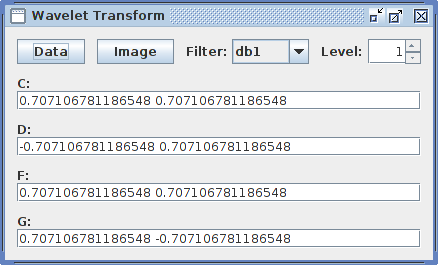
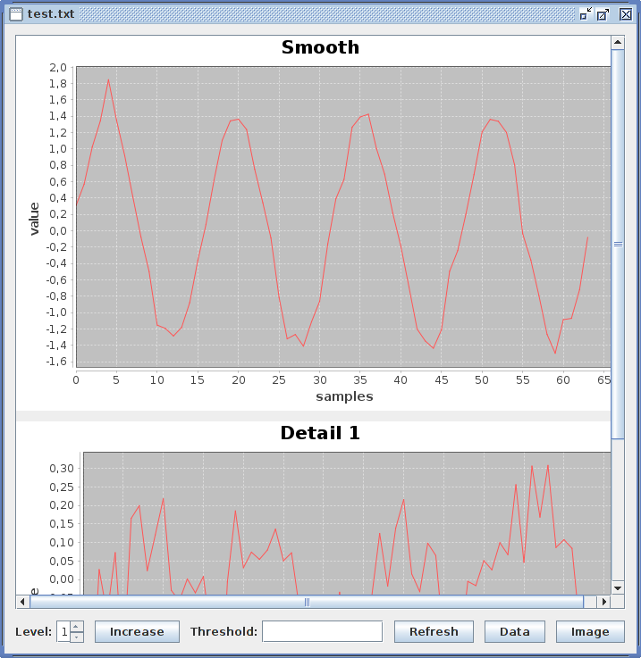
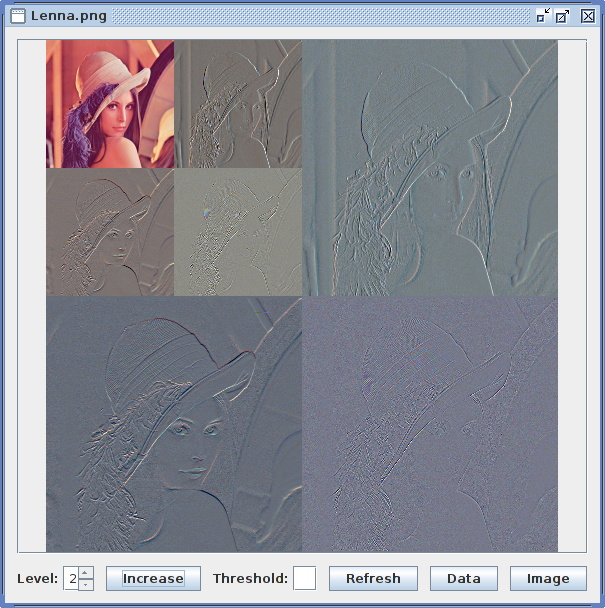

# Wavelet Transform

Developed for an undergraduate/graduate course in Computer Vision Fundamentals.

It's thoroughly un-optimized. I tried to make everything work generically for 1D and 2D transforms, but couldn't achieve it completely.

Also, there's 2 bugs I still coulnd't fix. Head over to the Issues section if you think you can help!

Uses the [JFreeChart](http://www.jfree.org/jfreechart/) library.

## Interface

### Main interface

The "Data" button loads a text file. Each line generates a transform.
A line with real values separated by space characters generates a 1D transform.
A line with two of the above defined value array separated by the character "A" generates a 2D transform. Additionally, up to four of these, separated by the character "B", represent different color channels.

* 1 component: black and white image.
* 2 components: black and white image with transparency.
* 3 component: color image.
* 4 components: color image with transparency.

The "Image" button loads an image and generates a 2D transform.
The "Filter" combo box loads predefined filter parameters.
The "Level" spinner sets the initial transform level.
The filter coefficient fields allow the input of custom filters.

### Transform interface

The "Level" spinner sets which transform level is displayed.
The "Increase" button increases the transform level by one.
The "Threshold" field sets the value for the soft threshold operation.
The "Refresh" button updates the transform view, to see changes in the threshold field.

The "Data" button exports the current transform view to text.
* 1D transform: Several signals separated by the "A" character. Each signal is a space separated value array. The first is the smoothed signal (or the original signal). The second is the last detail signal. The third is the penultimate detail signal. And so on until the last signal, which is the first detail signal.
* 2D transform: Several color channels separated by the "D" character. Each color channel is a matrix array, separated by the "C" character. The first of these matrices represent the smoothed image, represented as mentioned before. The second matrix is a detail image array, separated by the "B" character. The first detail image represent the image filtered by the low pass filter in the vertical direction and the high pass filter in the horizontal direction. Second detail image: high pass in the vertical and low pass in the horizontal. Third detail image: high pass in the vertical and high pass in the horizontal. The rest is as mentioned before.

The "Image" button exports the current transform view to an image file.
